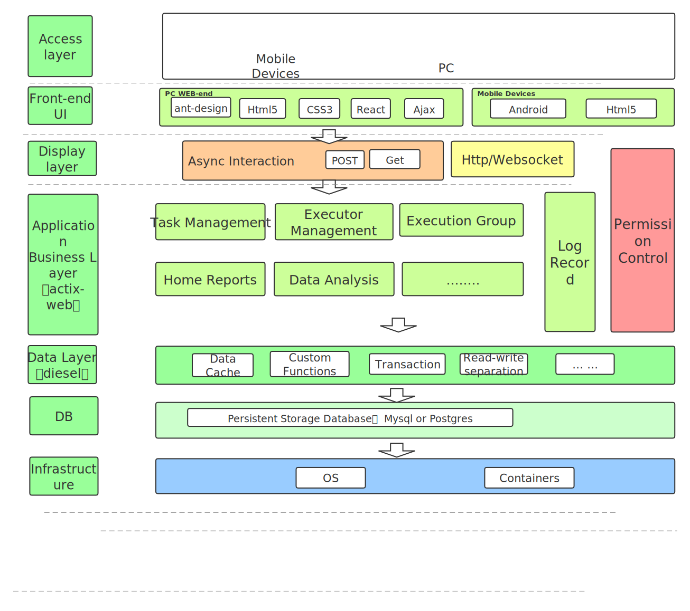
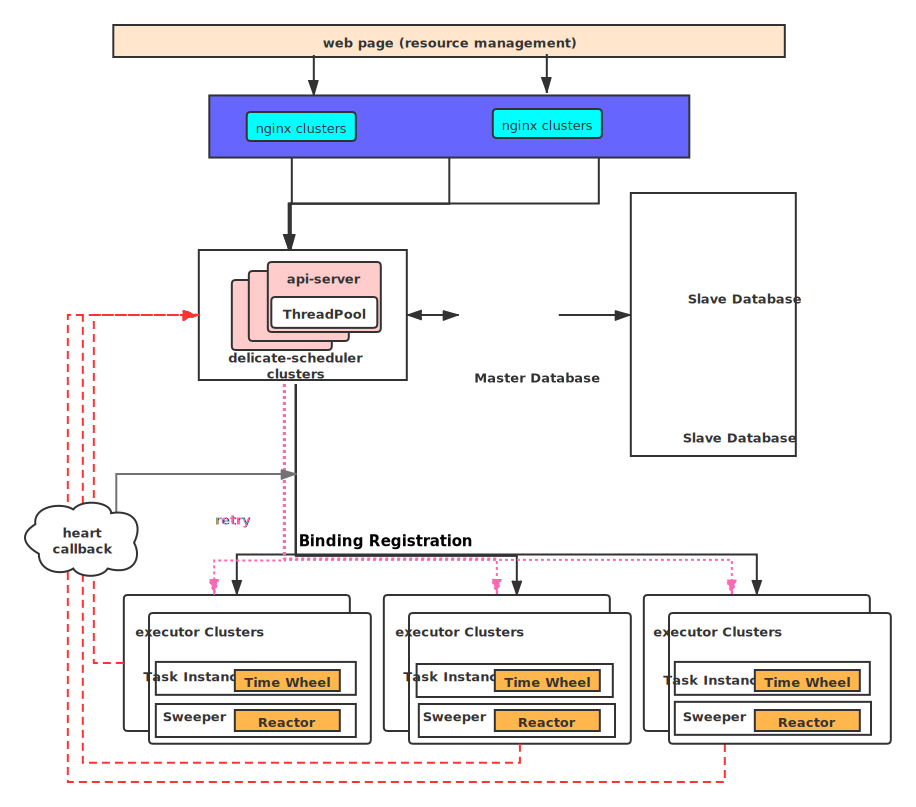

# Delicate   
[](
https://github.com/BinChengZhao/delicate/actions)
[](
https://github.com/BinChengZhao/delicate)
## English | [简体中文](./README_zhCN.md)

- [delicate](#delicate)
  - [What is delicate](#what-is-delicate)
  - [Features](#features)
  - [Benchmark](#benchmark)
  - [Get Started](#get-started)
    - [Setting up delicate](#setting-up-delicate)
  - [Quick start](#quick-start)
  - [Documentation](#documentation)
  - [Roadmap](#roadmap)
  - [Contributing](#Contributing)
  - [License](#license)

## What is delicate
<a href="">
    
</a>

`delicate` A lightweight and distributed task scheduling platform written in rust.:

## features
- **Friendly UI:** [Front-end] Convenient management of tasks & executors, monitoring their status and supporting manual maintenance etc.

- **Flexible Operations:** Flexible task operations, support for limiting the maximum number of parallelism in a single node, time zone settings corresponding to cron expressions, scheduling modes (single, fixed number, constantly repeating), the ability to manually trigger tasks at any time, manually terminate task instances, and view task logs online.

- **High Availability:**  Delicate supports unlimited horizontal expansion. It's easy to achieve high availability and performance by deploying as many Delicate servers and executors.

- **High Performance:** Lightweight and essential features speed up the performance, The basic resource overhead for `delicate` is roughly (less than 0.1% cpu usage, with about 10m of memory.)

- **Observability:**  There are many meaningful statistics periodically in a readable way.

- **Upgrade:**  Dynamic upgrade of the system (upgrade is done by obtaining the latest source code and performing database migration.

The architecture of delicate:





## Benchmark
Task take about 6,424 ns (+/- 52) per scheduling on CentOS Linux release 7.6.1810 (Core)  (varies by OS/hardware).

The rest of the overall indicators await bench.

## Get Started

The basic common usage of delicate is to quickly set up for the backend servers and executors. We split it into multiple simple steps to illustrate the delicate concepts and operations.

The source code installation requires:
 * [rustc](https://www.rust-lang.org/tools/install) (minimum-supported version of `rustc` is **1.49**.) 
 * libmysqlclient-dev & libpq-dev & libssl-dev

### Setting up delicate

<!-- We can download the binary from [release page](https://github.com/BinChengZhao/delicate/releases).  -->
<!-- 
For example we use linux version:

```bash
$ mkdir delicate
$ wget https://github.com/BinChengZhao/delicate/releases/download/v1.0.0/delicate-v1.0.0-linux-amd64.tar.gz
$ tar zxvf delicate-v1.0.0-linux-amd64.tar.gz -C delicate && cd delicate -->


1. install the rust suite: ` curl --proto '=https' --tlsv1.2 -sSf https://sh.rustup.rs | sh ` or ` curl --tlsv1.2 -sSf https://sh.rustup.rs | sh ` or `curl https://sh.rustup.rs -sSf | sh`  .  （It is possible to encounter a curl error and need to retry several times, These problems are usually due to the fact that the curl version is too low, or the network is unstable.）

2. initialize cargo in the current shell, ` source $HOME/.cargo/env ` .  

3. Get the delicate source code and compile it ( this is an example, please get the corresponding Tag version according to your needs ) : ` git clone https://github.com/BinChengZhao/delicate.git ` .

4. ` cd delicate/ ` .

5. ` cargo check ` , check for environment dependencies etc.

6. when error: linker `cc` not found: solution : ` yum -y install gcc ` .

7. when ` --- stderr thread 'main' panicked at 'Without `*` set in .env: NotPresent'` then you need to set the environment variable, using the project's  template.env ` .

8. ` cp template.env .env ` and start modifying the configuration. 

9. Compile the executable with ` cargo build --release ` after passing it.

10. Start delicate-scheduler: ` nohup target/release/delicate-scheduler >> scheduler.log 2>&1 &` on the machine where the server is deployed .

11. start delicate-executor: ` nohup target/release/delicate-executor >> executor.log 2>&1 & ` on the machine performing the task .

12. Please refer to `delicate-web/README.md` for the deployment of front-end resources.

13. `delicate-scheduler` & `delicate-web` need to be under the same domain (such as `api.delicate.com` & `web.delicate.com`), so as to avoid cross-domain issues, Both `delicate-scheduler` & `delicate-web` can be deployed in clustered versions, accessible via reverse proxy.


## Quick start
[Quick-start](./doc/quick_start.md)

## Documentation

See [reference](./doc/reference.md) for more information.


## To Do List
- [ ] I18n.
- [ ] Permission Management.
- [ ] Multiple login protocols, LDAP CAS .
- [ ] Machine resource panel, online view of processes, memory, cpu, etc.
- [ ] Database back-end support Postgres.
- [ ]  `scheduler & executor` communication using RPC, but currently there are problems with dependencies (RPC framework (`tonic ｜ tarpc`) both depend on tokio 1,current actix-web stable version 3, does not support integration with tokio 1 ).
- [ ] Task flow support.
- [ ] Dynamic executor load adjustment, where the resource group adjusts the task load of the task execution nodes according to the machine metrics.


## Roadmap 

See [delicate Roadmap](./doc/Roadmap.md) for details.


## Contributing

:balloon: Thanks for your help improving the project! We are so happy to have
you! We have a contributing guide to help you get involved in the Delicate
project.

[Rust-guide](./CONTRIBUTING.md)
[Js-guide](./delicate-web/CONTRIBUTING.md)


## Thanks
Sincere thanks to my friend `Walker-os` who helped me solve a lot of front-end resource problems and speed up the release of delicate and `Liping Wang` help me beautify the logo.

# Stargazers over time

[](https://starchart.cc/BinChengZhao/delicate)


## License

Licensed under either of

 * MIT license ([LICENSE-MIT](LICENSE-MIT) or http://opensource.org/licenses/MIT)

#### Contribution

Unless you explicitly state otherwise, any contribution intentionally submitted
for inclusion in the work by you, as defined in the Apache-2.0 license, shall be
dual licensed as above, without any additional terms or conditions.
