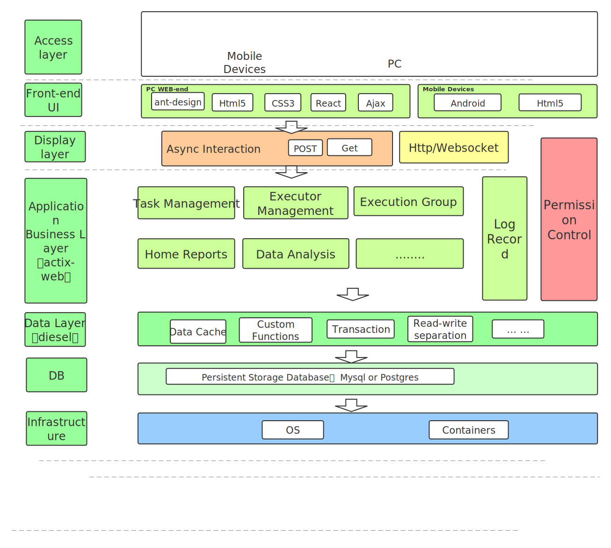

# English | [简体中文](./README_zhCN.md)

- [delicate](#delicate)
  - [What is delicate](#what-is-delicate)
  - [Features](#features)
  - [Benchmark](#benchmark)
  - [Get Started](#get-started)
    - [Setting up delicate](#setting-up-delicate)
  - [Documentation](#documentation)
  - [Roadmap](#roadmap)
  - [License](#license)

## What is delicate
<a href="">
    
</a>

`delicate` A lightweight and distributed task scheduling platform written in rust.:

## features
- **Friendly UI:** [Front-end] *** manage their task | executor, monitor the status, check the logs online, etc.
- **High Availability:**  Delicate supports unlimited horizontal expansion. It's easy to achieve high availability and performance by deploying as many Delicate servers and executors.
- **High Performance:** Lightweight and essential features speed up the performance.
- **Observability:**  There are many meaningful statistics periodically in a readable way.
- **Integration:**  etc.
- **Upgrade:**  Dynamic upgrade of the system (upgrade is done by obtaining the latest source code and performing database migration.

The architecture of delicate:



- **Service Management**
	- **Security**
- **High Performance and Availability**
	- **Adaption**: .
	- **Validation**: .
	- **Load Balance:** .
	- **Cache:** .
	- **Hot-Update:** updates both config and binary of delicate in place without losing connections.

## Benchmark

## Get Started


The basic common usage of delicate is to quickly set up for the backend servers and executors. We split it into multiple simple steps to illustrate the delicate concepts and operations.

The source code installation requires:
 * rustc [rustup](https://www.rust-lang.org/tools/install) 
 * libmysqlclient-dev libpq-dev 

### Setting up delicate

We can download the binary from [release page](https://github.com/BinChengZhao/delicate/releases). For example we use linux version:

```bash
$ mkdir delicate
$ wget https://github.com/BinChengZhao/delicate/releases/download/v1.0.0/delicate-v1.0.0-linux-amd64.tar.gz
$ tar zxvf delicate-v1.0.0-linux-amd64.tar.gz -C delicate && cd delicate
```

or use source code:

```bash
$ git clone https://github.com/BinChengZhao/delicate && cd delicate
$ cargo *****
```


## Documentation

See [reference](./doc/reference.md) and [developer guide](./doc/developer-guide.md) for more information.


## To Do List
- [ ] I18n.
- [ ] Permission Management.
- [ ] Multiple login protocols, LDAP CAS .
- [ ] Machine resource panel, online view of processes, memory, cpu, etc.
- [ ] Database back-end support Postgres.
- [ ]  `scheduler & executor` communication using RPC, but currently there are problems with dependencies (RPC framework (`tonic ｜ tarpc`) both depend on tokio 1,current actix-web stable version 3, does not support integration with tokio 1 ).
- [ ] Task flow support.
- [ ] Dynamic actuator load adjustment, where the resource group adjusts the task load of the task execution nodes according to the machine metrics.


## Roadmap 

See [delicate Roadmap](./doc/Roadmap.md) for details.

## Thanks
Sincere thanks to my friend `Walker-os` who helped me solve a lot of front-end resource problems and speed up the release of delicate.

# Stargazers over time

[](https://starchart.cc/BinChengZhao/delicate)


## License

Licensed under either of

 * MIT license ([LICENSE-MIT](LICENSE-MIT) or http://opensource.org/licenses/MIT)

## To Do List

#### Contribution

Unless you explicitly state otherwise, any contribution intentionally submitted
for inclusion in the work by you, as defined in the Apache-2.0 license, shall be
dual licensed as above, without any additional terms or conditions.
