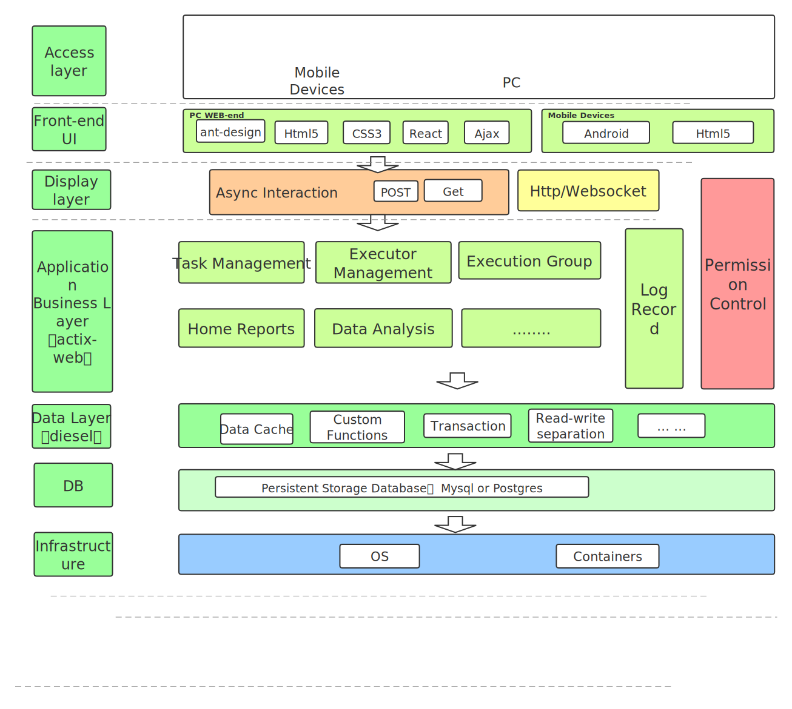
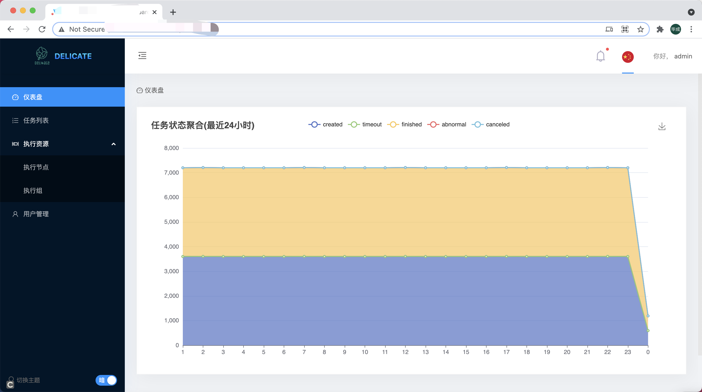

# Delicate   
[](
https://github.com/BinChengZhao/delicate/actions)
[](
https://github.com/BinChengZhao/delicate)
## [English](./README.md)

- [delicate](#delicate)
  - [什么是delicate](#what-is-delicate)
  - [特性](#特性)
  - [Benchmark](#benchmark)
  - [上手 delicate](#get-started)
    - [部署 delicate](#部署-delicate)
  - [快速开始](#quick-start)
  - [文档](https://delicate-rs.github.io/Roadmap.html)
  - [路线图](#roadmap)
  - [贡献指南](#Contributing)
  - [License](#license)

## What is delicate
<a href="">
    
</a>

`delicate` 一个轻量的分布式的任务调度平台通过rust编写. :

## 特性
- **友好的用户界面：** [前端]方便地管理任务和执行器，监控其状态，支持手动维护运行中的任务等。

- **灵活的操作：** 灵活的任务操作，支持限制单个节点的最大并行数，与cron表达式相对应的时区设置，调度模式（单一、固定数量、不断重复），能够在任何时候手动触发任务，手动终止任务实例，在线查看任务日志。

- **高可用性：** Delicate支持横向扩展。通过部署尽可能多的Delicate服务器和执行器，很容易实现高可用性和性能。

- **高性能：** 轻量级和基本功能加快了性能，`delicate'的基本资源开销大约是（小于0.1%的cpu使用率，10m的内存.)

- **可观察性:** 有许多有意义的统计数据定期以图表的方式展现。

- **升级：** 系统的动态升级（升级是通过获得最新的源代码和进行数据库迁移.)

- **复用性：**  执行器提供`restful-api` ，可以让用户应用维护自定义任务.

- **权限管理：**  基于casbin实现的权限管理功能，持续优化体验.


`Delicate` 架构图:




## 项目效果图
<details>
<summary>请点击</summary>




</details>


## Benchmark
每次调度耗时 6,424 ns (+/- 52) 在 CentOS Linux release 7.6.1810 (Core) (不同系统/硬件会有不同的结果).

系统：CentOS Linux release 7.6.1810 (Core) - 4核/8G：

单节点: delicate-executor 

任务创建，峰值cpu消耗 3%，qps：17000+

任务取消，峰值cpu消耗 3%，qps：18000+

任务手动调度，峰值cpu消耗 3.5%，qps：14000+

任务移除，峰值cpu消耗 3%，qps：14000+

健康检查，峰值cpu消耗 4%，qps：2600+

峰值的内存消耗都在60M之内。

其它的指标等待压测.

## Get Started

如下是`Delicate` - `scheduler` & `executor` 的基本用途和快速设置。
我们把它分成多个简单的步骤来说明`Delicate`的概念和操作.

源码安装的依赖:
 * [rustc](https://www.rust-lang.org/tools/install) (minimum-supported version of `rustc` is **1.54**.) 
 * libmysqlclient-dev & libpq-dev & libssl-dev

### 部署 delicate

<!-- We can download the binary from [release page](https://github.com/BinChengZhao/delicate/releases).  -->
<!-- 
For example we use linux version:

```bash
$ mkdir delicate
$ wget https://github.com/BinChengZhao/delicate/releases/download/v1.0.0/delicate-v1.0.0-linux-amd64.tar.gz
$ tar zxvf delicate-v1.0.0-linux-amd64.tar.gz -C delicate && cd delicate -->


1. 安装rust套件。` curl --proto '=https' --tlsv1.2 -sSf https://sh.rustup.rs | sh ` 或 ` curl --tlsv1.2 -sSf https://sh.rustup.rs | sh ` 或 `curl https://sh.rustup.rs -sSf | sh` 。 有可能遇到curl错误，需要重试几次，这些问题通常是由于curl的版本太低，或者网络不稳定造成的。

2. 在当前shell中初始化cargo，` source $HOME/.cargo/env ` 。 

3. 获取`delicate`的源代码并编译它（这是一个例子，请根据你的需要获取相应的Tag版本）。` git clone https://github.com/BinChengZhao/delicate.git ` 。

4. `cd delicate/ ` 。

5. ` cargo check ` ，检查环境依赖性等。

6. 当错误：没有找到链接器`cc`时：解决方案：` yum -y install gcc ` 。

7. 当` --- stderr线程'main'在'Without `*` set in .env: NotPresent "时，你需要设置环境变量，使用项目的template.env"。

8. ` cp template.env .env ` 然后开始修改配置。

9. 通过后用`cargo build --release`编译可执行文件。

10. 启动delicate-scheduler： ` nohup target/release/delicate-scheduler >> scheduler.log 2>&1 &` 在部署服务器的机器上。

11. 启动delicate-executor。` nohup target/release/delicate-executor >> executor.log 2>&1 & ` 在执行任务的机器上。

12. 关于前端资源的部署，请参考[README.md](./delicate-web/README.md)。

13. `delicate-scheduler`和`delicate-web`需要在同一个域下（如`api. delicate.com`和`web. delicate.com`），以避免跨域问题，`delicate-scheduler`和`delicate-web`都可以通过反向代理部署为集群版本。


## Quick start
[快速开始](./doc/src/quick_start_zh_cn.md)

## documentation

See [reference](./doc/src/reference.md) for more information.


## To Do List
- [] I18n.
- [] 权限管理。
- [] 多种登录协议，LDAP CAS.
- [] 机器资源面板，在线查看进程、内存、cpu等。
- [] 数据库后端支持Postgres。
- [] 使用RPC的 "scheduler & executor "通信，但目前存在依赖性问题（RPC框架（"tonic ｜ tarpc"）都依赖tokio 1，目前actix-web稳定版3，不支持与tokio 1集成）。
- [] 支持任务流。
- [] 动态执行器负载调整，资源组根据机器指标调整任务执行节点的任务负载。


## Roadmap 

查看更多路线图详情 [delicate Roadmap](./doc/src/Roadmap.md) .

## Contributing

:balloon: 感谢你对改进项目的帮助! 我们非常高兴能有你的参与! 这里有一个贡献指南，以帮助你参与到Delicate
项目.

[Rust-guide](./CONTRIBUTING.md)
[Js-guide](./delicate-web/CONTRIBUTING.md)


## 感谢
我们要感谢整个社区和代码贡献者。特别是，感谢过去两个月的代码贡献者:
[Walker-os](https://github.com/Walker-os)


感谢用户报告文档中的拼写错误, 这非常感谢大家。
感谢用户加入我们，提供反馈，讨论功能，并获得帮助!

# Stargazers over time

[](https://starchart.cc/BinChengZhao/delicate)


## License

Licensed under either of

 * MIT license ([LICENSE-MIT](LICENSE-MIT) or http://opensource.org/licenses/MIT)

#### Contribution

Unless you explicitly state otherwise, any contribution intentionally submitted
for inclusion in the work by you, as defined in the Apache-2.0 license, shall be
dual licensed as above, without any additional terms or conditions.
