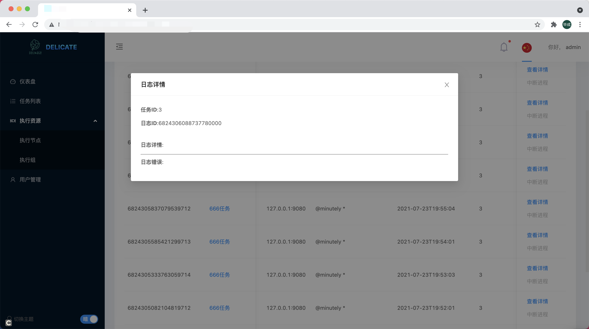

- [Executor Group](#executorgroup)
    - [Configuration](#configuration-1)

- [Executor Processor](#executorprocessor)
    - [Configuration](#configuration-2)

- [Executor Processor Bind](#executorprocessorbind)
    - [Configuration](#configuration-3)

- [Task](#task)
    - [Configuration](#configuration-4)

- [Task Instance](#taskinstance)
    - [Configuration](#configuration-5)

- [User](#user)
    - [Configuration](#configuration-6)

- [Status Data Aggregation](#statusdataaggregation)

- [Security](#security)

## ExecutorGroup

`Executor Group` which corresponds to a service, or a business.

### Configuration-1

| Name           | Type                                               | Description                                                                                                                                     | Required |
| -------------- | -------------------------------------------------- | ----------------------------------------------------------------------------------------------------------------------------------------------- | -------- |
| name   | string                                              | Group name                                                                        | Yes       |
| description   | string                                              | Group description                                                                        | Yes       |
| tag   | string                                              | Group tag                                                                        | Yes       |

## ExecutorProcessor

`Executor Processor` which corresponding to a physical machine, or a container.

### Configuration-2

| Name           | Type                                               | Description                                                                                                                                     | Required |
| -------------- | -------------------------------------------------- | ----------------------------------------------------------------------------------------------------------------------------------------------- | -------- |
| name   | string                                              | Processor name                                                                        | Yes       |
| description   | string                                              | Processor description                                                                        | Yes       |
| tag   | string                                              | Processor tag                                                                        | Yes       |
| host   | string                                              | Processor host ,  No spaces between strings, (example: 12.34.56.78:9080 )                                                                      | Yes       |
| machine_id   | int                                              | Processor machine-id , Value range (0 to 1023). In order to mark custom machine serial numbers and to be able to using snowflake algorithm generate unique task-instance-id                                                                       | Yes       |

## ExecutorProcessorBind

`Executor Processor Bind`, which corresponds to the association between a `Executor Group` and a `Executor Processor`, and the task needs to select the machine(Executor Processor) to execute through the association `Executor Processor Bind`. 

Tip:

When there are hundreds of tasks associated with a certain `Executor Processor Bind`, it is easy to switch the machine that executes the task if you want to. Just modify the `Executor Processor` associated with the `Executor Processor Bind`, then hundreds of tasks will be removed from the old machine and executed on the new machine.

### Configuration-3

| Name           | Type                                               | Description                                                                                                                                     | Required |
| -------------- | -------------------------------------------------- | ----------------------------------------------------------------------------------------------------------------------------------------------- | -------- |
| group_id   | int                                              | Group id                                                                         | Yes       |
| executor_id | int                                            | Processor id      | Yes       |
| name | string                                            | Binding name      | Yes       |
| weight | int                                            | Resource Occupancy Weights    | Yes       |

## Task

`Task` which corresponds to a set of commands given by the user that will be executed on the machine to generate task instances.

### Configuration-4

| Name           | Type                                               | Description                                                                                                                                     | Required |
| -------------- | -------------------------------------------------- | ----------------------------------------------------------------------------------------------------------------------------------------------- | -------- |
| name   | string                                              | Task name                                                                    | Yes       |
| description | string                                            | Task sescription       | Yes       |
| command | string                                            | Task Commands for task execution    | Yes       |
| frequency | string                                            | Frequency for task execution        | Yes       |
| cron_expression | string                                            | Cron Expression for task execution         | Yes       |
| timeout | int                                            | Cron Timeout for task execution       | Yes       |
| retry_times | int                                            | Retry times for task execution        | Yes       |
| retry_interval | int                                            | Retry interval for task execution        | Yes       |
| tag | string                                            | Task's tag       | Yes       |
| binding_ids | [int]                                            | Task's bingding       | Yes       |

## TaskInstance

`Task Instance` which corresponds to an instance of a running task (e.g a running process).

### Configuration-5

| Name           | Type                                               | Description                                                                                                                                     | Required |
| -------------- | -------------------------------------------------- | ----------------------------------------------------------------------------------------------------------------------------------------------- | -------- |
| id   | int                                              | Unique id generated by snowflake algorithm                                                                     | Yes       |
| task_id | int                                            | Task's id       | Yes       |
| name | string                                            | Task name (snapshot)       | Yes       |
| description | string                                            | Task description (snapshot)       | Yes       |
| command | string                                            | Task's id       | Yes       |
| frequency | string                                            | Task's frequency (snapshot)       | Yes       |
| cron_expression | string                                            | Task's cron_expression (snapshot)      | Yes       |
| maximum_parallel_runnable_num | int                                            | Task 'smaximum_parallel_runnable_num (snapshot)       | Yes       |
| tag | string                                            | Task's tag (snapshot)       | Yes       |
| status | int                                            | Task's Status Included(Running = 1,Finished = 2,AbnormalEnding = 3,TimeoutEnding = 4,TmanualCancellation = 5,Unknown = 81)       | Yes       |
| created_time | datetime                                            | Task Instance creation time       | Yes       |
| updated_time | datetime                                            | Task Instance Update time        | Yes       |
| executor_processor_id | int                                            | Executor processor id       | Yes       |
| executor_processor_name | string                                            | Executor processor name (snapshot)      | Yes       |
| executor_processor_host | string                                            | Executor processor host       | Yes       |

 
## User

`User` which corresponds to users of the system.

PS: When the system is first installed, you can set the initial user in `.env`.

### Configuration-6

| Name           | Type                                               | Description                                                                                                                                     | Required |
| -------------- | -------------------------------------------------- | ----------------------------------------------------------------------------------------------------------------------------------------------- | -------- |
| user_name   | string                                              |User account, must be unique                                                                     | Yes       |
| nick_name | string                                            | User nickname       | Yes       |
| mobile | string                                            | Mobie-number(unique)       | Yes       |
| email | string                                            | Email(unique)       | Yes       |
| certificate | string                                            | Password credentials (the station saves the password, the station does not save or save the token)       | Yes       |

## StatusDataAggregation

delicate aggregates the task scheduling for the latest day, including: (successful scheduling, timeout, manual cancellation, abnormal end, normal end, etc.), which we can view in the home dashboard.

## Security

There are two levels of security, 0 and 1.
This can be adjusted by setting the environment variable `DELICATE_SECURITY_LEVEL`.

At level 0, the executor and scheduler communicate without security signatures.

Under level 1, executor and scheduler will use RSA key for authentication when binding, and then dynamically generate a token, which will be stored in the database of scheduler, and each subsequent communication will use token & sha2 hash algorithm for signature authentication.

