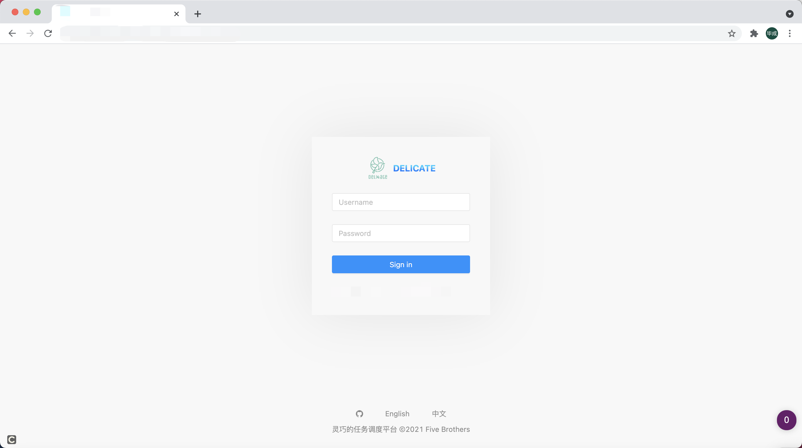
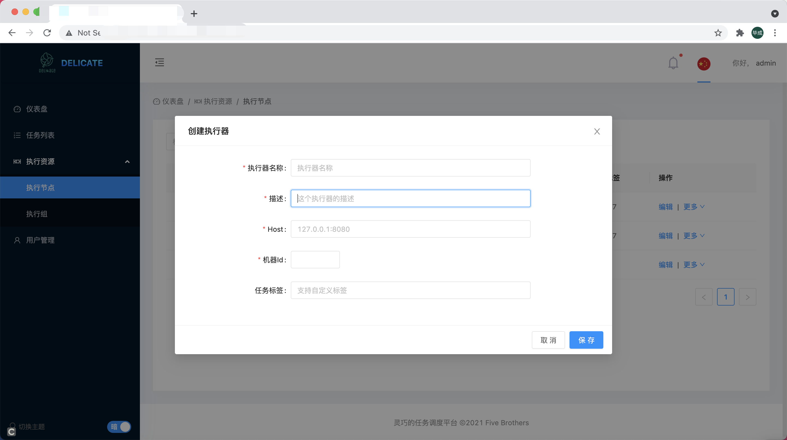
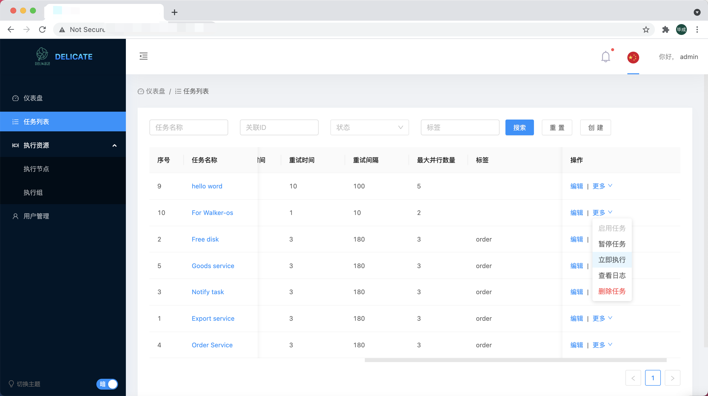
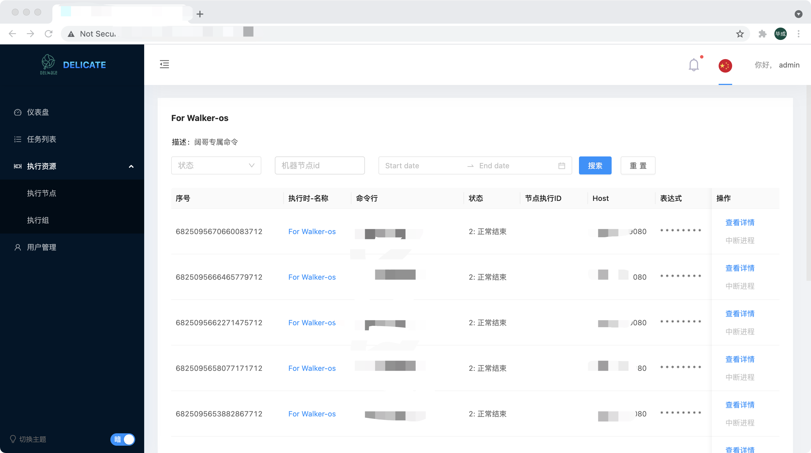

After the deployment, we can start using the delicate related functions.

First login via .env (`INITIAL_ADMINISTRATOR_USER_NAME`) , the initialized user.

First, we go to `execution-resources-executor-node` to maintain `delicate-executor` into our system as a machine resource and perform the activation operation.

Then, go to the `execution-resources-execution-groups` menu to add our resource group and do binding with the corresponding `execution-node` to generate `binding items`.

Next, go to the `Task List` to add our scheduling task and associate our `binding item`.

When a task starts scheduling, a scheduling log is generated, and we can click the `More` button -> `View Log` for the specified task under the task list.

Each task run log corresponds to a `task instance`, which can be cancelled at any time when it is running. Tasks that have finished running, or have timed out, can be viewed with standard output and standard errors generated by the task execution.

For more content, please see doc.