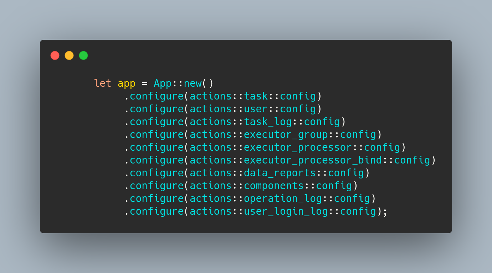
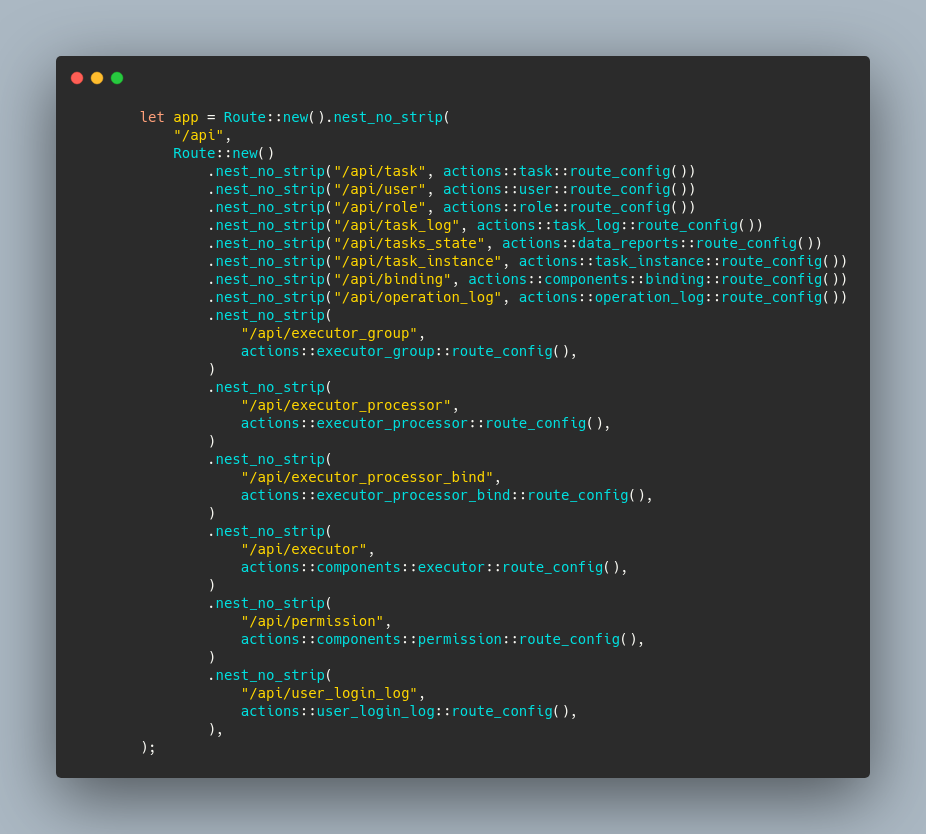
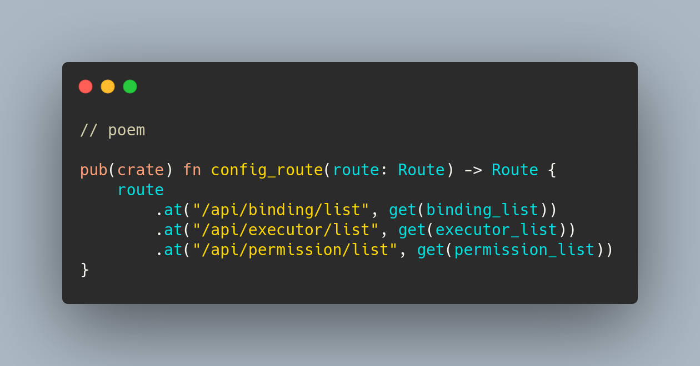
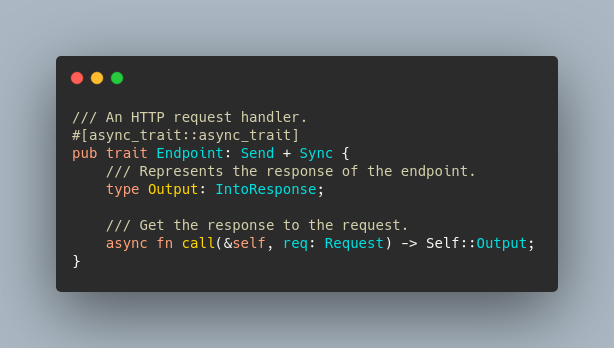
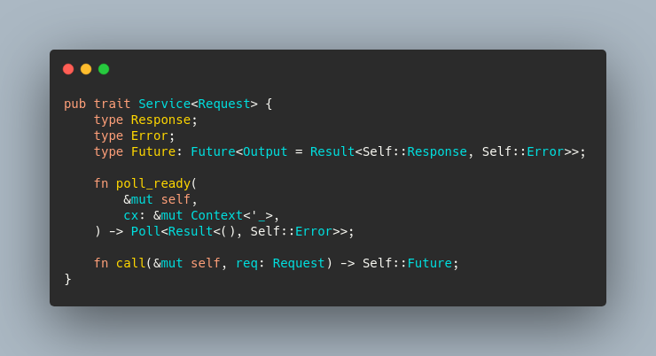
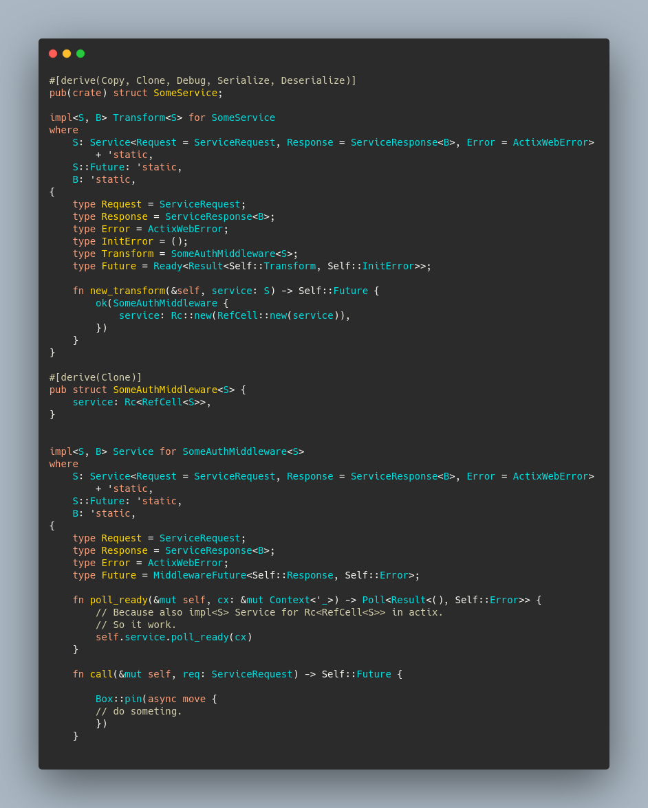

`delicate` Project Background.

 Distributed scheduling system. [delicate](https://github.com/BinChengZhao/delicate)

1. 5w lines of code + documentation, etc.
2. main language is Rust + js.

The migration involved 45 file changes and 4000 lines of code changes (2500 additions and 1579 deletions), which were completed in 20 hours.

For more details please check:

Why migrate to `poem`?

The iterative progress of actix-web is not keeping up with the current needs.

Brief background on `poem`.

1. The framework has an extremely fast performance, consistent philosophy, and clean implementation.
2. based on `hyper`, combined with `tokio` users have more control.

The focus of the migration.

1. recombination of web components. 

2. api level modifications to avoid business logic adjustments.

etc...

*. handle in poem, is an asynchronous state machine, using tokio it can be computed efficiently in a multi-threaded runtime.
   This is not the case with actix-web, which is single-threaded. Because of this subtle difference, the handle previously used for actix-web
   The difference here is that the handle previously used for actix-web cannot be used for `poem`, because the values across .await need to be kept in Send, which is a lot of work.

*. poem's route, a root route, and then multiple mods constantly at inside, different from the original actix-web config.

*. poem's error supports Send, actix-web's error does not support Send, which makes cross-threading difficult.

Need to modify all middleware implementations, need to revamp all handlers, need to adjust all global state.

I am also grateful to the actix-web community for such a great piece of work, and I decided to migrate to `poem` because of technical selection issues.

在使用 actix-web时，因为actix-web 4 稳定版，一直没有出来，我想使用兼容tokio 1.0 的库一直是一个很难的问题。

当使用 poem 且 透明的依赖tokio时，我感到了前所未有的灵活性。
直接使用tokio生态的组件，去代替原来 actix-web 的一些组件,并且把大量的依赖进行了升级，
再也不用自己人工制作补丁，或者使用陈旧的依赖。

When using actix-web, it has been a difficult problem to use the tokio 1.0 compatible library because actix-web 4 stable version has not been officially released.

When using poem and transparently relying on tokio, I felt more flexibility than ever before.
I was able to replace some of the original actix-web components directly with tokio eco-components, and upgrade a lot of dependencies.
No more manual patching, or using old dependencies.

1. `actix-web` 相关依赖的移除，替换为 `poem` & `tokio`.
2. 在直接依赖 `tokio` 1.0 的情况下升级多处依赖。
3. 全局所有中间件的改造。
4. 应用风格从 `actix-web` 转变到 `poem` & `tokio` 的组合风格。
5. 全链路的测试，并编写迁移纪要。

1. `actix-web` related dependencies are removed and replaced with `poem` & `tokio`.
2. upgrade multiple dependencies with direct dependencies on `tokio` 1.0.
3. global modification of all middleware. 4.
4. application style change from `actix-web` to `poem` & `tokio` combined style.
5. full link testing and writing migration logs.

poem 中有一些相通 tower-Service的概念， Endpoint 

代码对比。

poem的中间件很轻量。

下面是一些 `poem` & `actix-web` 的对比:

actix-web 之前的大量路由组通过config，去注册：

在 poem 中大量路由组通过Route去组织，可以多重嵌套：

也可以制作一个跟Route去不断地at：

poem 中的handler

Endpoint
The endpoint can handle HTTP requests. You can implement the Endpoint trait to create your own endpoint. Poem also provides some convenient functions to easily create a custom endpoint type.

In the previous chapter, we learned how to use the handler macro to convert a function to an endpoint.

Now let's see how to create your own endpoint by implementing the Endpoint trait.

This is the definition of the Endpoint trait, you need to specify the type of Output and implement the call method.

poem 的Endpoint 哲学，跟tower中的Service 非常相似，但是poem更简洁一些

All types that can be converted to HTTP response Response should implement IntoResponse, and they can be used as the return value of the handler function.

使用poem制作中间件非常的轻松，如下是一个给请求增加 logger-id 的middlware的实例

如下是actix-web 实现middlware的模板示例,模板代码确实稍有冗长

## 感谢

谢谢你

我们要感谢整个社区和代码贡献者。特别是`poem`的作者:
[油条哥](https://github.com/sunli829)

感谢用户报告文档中的拼写错误, 这非常感谢大家。
感谢用户加入我们，提供反馈，讨论功能，并获得帮助!

在迁移过程中，我也有一些需求使用poem是无法处理的，比如 `CookieSession`

随后，我在 poem 上打开了一个issues，不到一天内就与作者沟通完成，并在poem支持了该功能。

// 写完投稿给张老师，油条哥预览下
// poem 中加一个宣传栏。

##### I've been away from work for a while, and I'm ready to find a new job. If you are interested in my work or need a Rust engineer, please contact me `binchengZhao@outlook.com` .