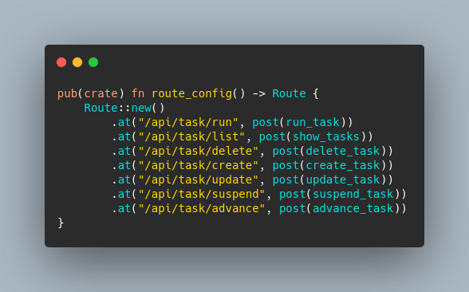
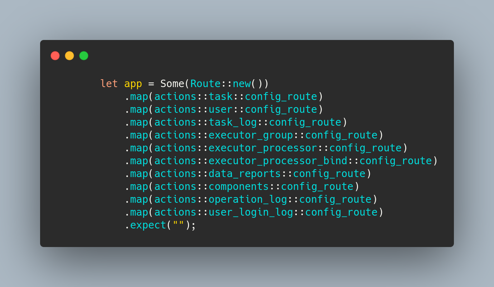

## 标题: Rust生产项目从 `actix-web` 迁移到 `poem`.

### `delicate` 的一些项目背景.

[delicate](https://github.com/BinChengZhao/delicate) 一个轻量的分布式的任务调度平台. 

1. 项目体积: 5w行代码+文档。
2. 主要语言是Rust + js。
3. 迁移涉及到45个文件的修改和4000行代码的修改（增加了2500行，删除了1579行）。

### 技术栈

* 后端( scheduler & executor ): Rust  

* 原主要的依赖: (actix-web & diesel & delay-timer & serde & tracing)

* 现主要的依赖: (poem & tokio & diesel & delay-timer & serde & tracing)

* 前端: antd-admin (React)

* Ui: Ant Design

* 数据库: mysql , postgres (计划支持)

### 为什么要迁移到`poem`'？

* 在使用 actix-web时，因为actix-web 4 稳定版，一直没有正式发布，我想使用兼容 `tokio`1.0 的库一直是一个需要迫切解决的问题，当`poem`发布时我知道机会来了。

* 在使用 `poem` 且透明的依赖tokio时，我感到了前所未有的灵活性。
直接使用tokio生态的组件，去代替原来 actix-web 的一些组件,并且把大量的依赖进行了升级，
再也不用自己人工制作补丁，或者使用陈旧的依赖。

#### 关于 `poem`的简要背景。

1. 该框架具有极快的性能，一致的理念，以及清晰的实现。
2. 基于`hyper`，与`tokio`结合，用户有更多的控制。

#### 迁移的重点：

1. 网络组件的重新组合，不同风格的维护应用状态。

2. api级别的修改，避免业务逻辑调整。

迁移前的基本梳理：

* poem中的`handler`会生成一个`Future`，框架与`tokio`的协作可以让请求在多线程运行时中进行效计算。

   而actix-web则不是这样，它是内部由多个单线程的`Runtime`组成。
   由于这种微妙的差别，以前用于actix-web的`handler`不能直接用于`poem`，
   因为需要确保每一个`handler`的输入状态，并且保证跨越.await的值需要都Send。

* poem的路由是一个可嵌套的`Endpoint`数据结构，与原来actix-web的配置不同。

* poem公开的数据结构大多支持Send，可以高效利用线程资源， 而`actix-web`与之相反。

* 需要修改所有的中间件实现，改造所有的后台Task，调整所有的全局状态。

* 在直接依赖 `tokio` 1.0 的情况下升级多处依赖。

* 全链路的测试，并编写迁移纪要。

### 下面是一些 `poem` & `actix-web` 的对比:

#### 路由侧
之前基于`actix-web`的实现，大量路由组通过configure去注册：

现基于 `poem`的实现， 大量路由组通过Route去组织，可以多重嵌套：

也可以制作一个根Route去不断地at：

#### handler
`poem` 中的 handler, 与原来差异并不大只需要调整一些 `extractor`, 对于一些阻塞性的task，切换到tokio的api去计算

#### Endpoint
`Endpoint` 抽象HTTP请求的Trait。

你可以实现`Endpoint`来创建你自己的`Endpoint`处理器。

如下是`Endpoint`的定义:

`poem` 的 `Endpoint` 哲学，跟tower中的`Service`非常相似，但是poem更简洁一些, 并且`poem`也兼容`tower`可以复用其生态与组件。

#### IntoResponse
`IntoResponse` 是响应数据的抽象。 

所有可以转换为HTTP响应的Response类型都应该实现IntoResponse，并且它们可以作为`handler`的返回值。

#### middleware

使用`poem`制作中间件非常的轻松，如下是一个给请求增加 logger-id 的middlware的示例

如下是actix-web 实现middlware的模板示例,模板代码确实稍有冗长,且耐人寻味。

## 感谢

在迁移过程中，我有一些需求使用`poem` 是无法直接处理
随后在 `poem` 上打开了几个issues，不到一天内就与作者沟通完成，并在`poem`支持了该功能，太强大了！

我要感谢整个社区和代码贡献者。特别是`poem`的作者:
[油条哥](https://github.com/sunli829)

谢谢你

感谢用户报告文档中的拼写错误, 这非常感谢大家。
感谢用户加入我们，提供反馈，讨论功能，并获得帮助!
我也很感谢`actix-web`社区这么好的作品，因为技术选择问题，我决定迁移到`poem`。

// 写完投稿给张老师，油条哥预览下

// `poem` 中加一个宣传栏。

### Repos:

[poem](https://github.com/poem-web/poem)

[delicate](https://github.com/BinChengZhao/delicate)

### 留言:

##### 最近我离开了原来的工作岗位，准备找一份新的工作。如果你对我的工作感兴趣并需要一名Rust工程师，请与我联系 `binchengZhao@outlook.com` .